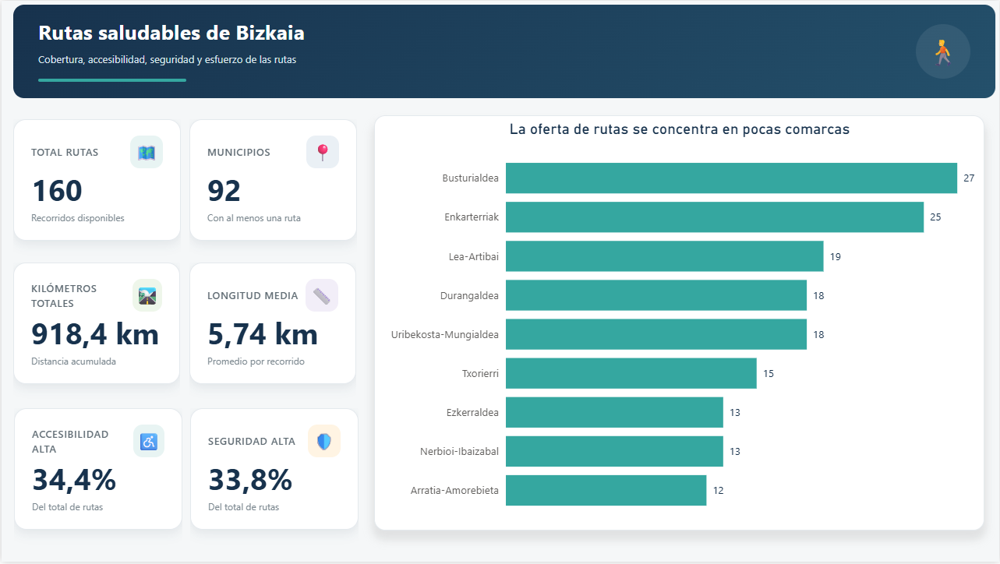
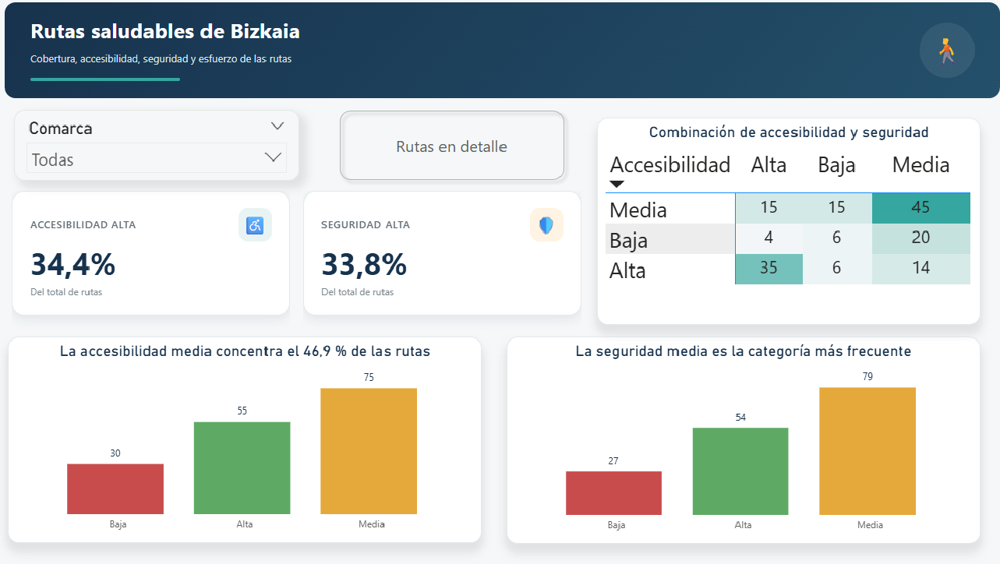
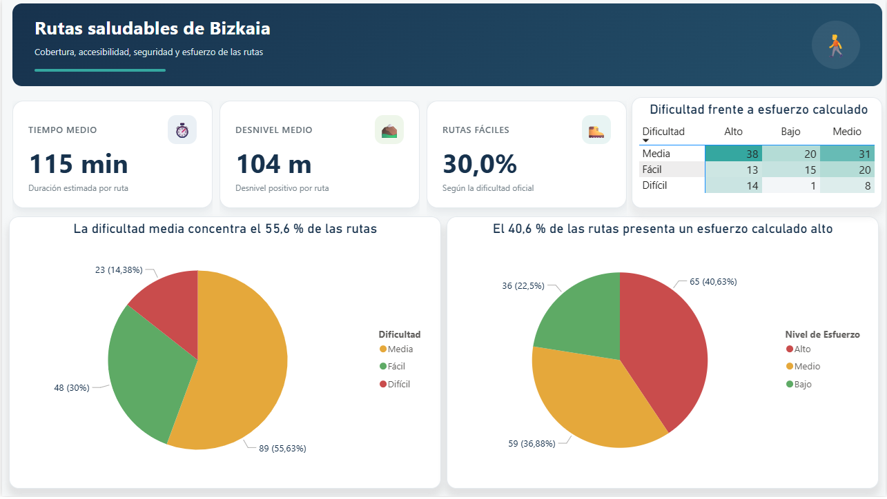
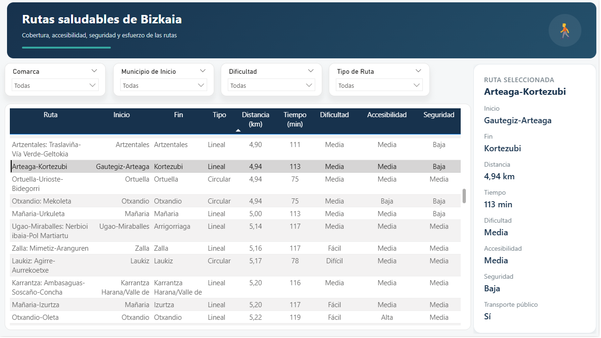
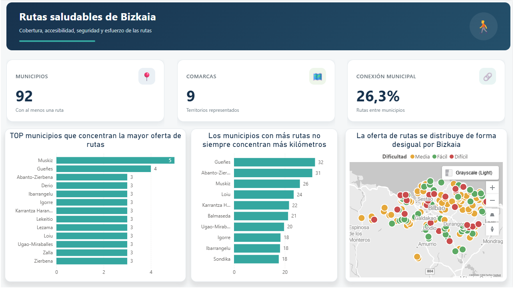
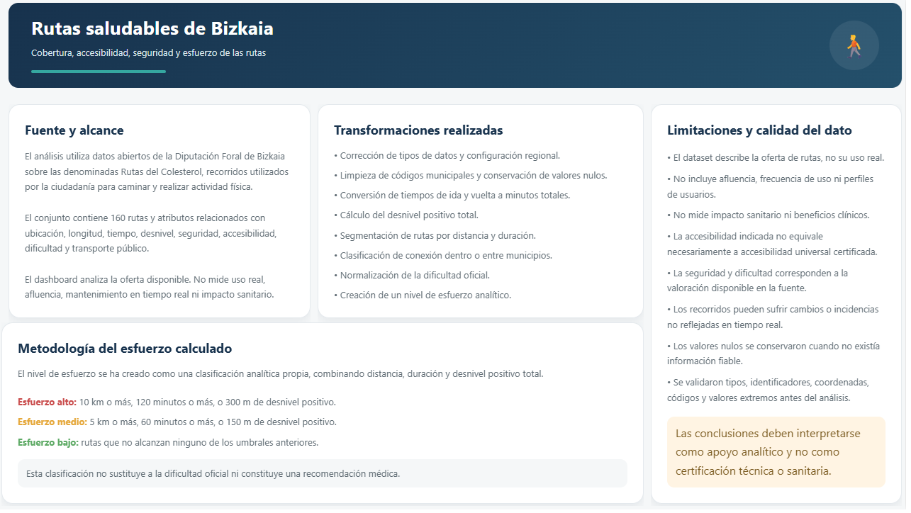

# Bizkaia Healthy Routes — Power BI Dashboard

   

An interactive Power BI dashboard developed to analyse the territorial coverage, accessibility, safety, difficulty and estimated effort of healthy walking routes across Bizkaia.

The project transforms an official open geospatial dataset into a structured analytical product, combining data preparation, **DAX**, geographic analysis, interactive exploration and visual storytelling.

---

## Project objective

The original dataset contains information about the **“Rutas del Colesterol de Bizkaia”**, walking routes used by citizens for physical activity.

The dashboard was designed to answer questions such as:

- How is the route offer distributed across Bizkaia?
- Which municipalities and regions contain the largest number of routes?
- What proportion of routes has high accessibility or safety?
- How do official difficulty and calculated effort compare?
- Which routes connect different municipalities?
- Which routes match a selected municipality, difficulty or route type?

---

## Main results

- **160** routes analysed
- **92** municipalities represented
- **9** regions represented
- ****918**.4 km** of accumulated route distance
- **5.74 km** average route length
- **34.4%** of routes with high accessibility
- **33.8%** of routes with high safety
- **40.6%** of routes with high calculated effort
- **26.3%** of routes connecting different municipalities

---

## Dashboard pages

### 01 — Executive overview

Provides a high-level view of the route catalogue through **KPI** cards and a regional ranking.

Main elements:

- total routes;
- municipalities represented;
- accumulated kilometres;
- average route length;
- high accessibility;
- high safety;
- number of routes by region.



### 02 — Accessibility and safety

Analyses the distribution of accessibility and safety ratings and their relationship.

Main elements:

- accessibility and safety KPIs;
- distribution by high, medium and low rating;
- accessibility × safety matrix;
- regional filter;
- detailed route view through drill-through navigation.



### 03 — Effort and difficulty

Compares the official difficulty classification with an analytical effort level calculated from distance, duration and positive elevation.

Main elements:

- average duration;
- average positive elevation;
- percentage of easy routes;
- official difficulty distribution;
- calculated effort distribution;
- difficulty × effort matrix.



### 04 — Route explorer

Allows users to search and inspect individual routes interactively.

Available filters:

- region;
- starting municipality;
- official difficulty;
- route type.

The selected-route panel displays:

- start and end municipality;
- route type;
- distance;
- estimated duration;
- difficulty;
- accessibility;
- safety;
- public transport availability.



### 05 — Territorial coverage

Explores how the route offer is distributed geographically.

Main elements:

- municipalities and regions represented;
- percentage of intermunicipal routes;
- municipalities with the highest number of routes;
- accumulated kilometres by municipality;
- geospatial map coloured by difficulty.



### 06 — Methodology and data quality

Documents the analytical process directly inside the report.

It includes:

- data source and analytical scope;
- transformations performed;
- calculated effort methodology;
- data limitations and quality considerations.



---

## Data source

The project uses the official open dataset:

**Rutas del colesterol de Bizkaia**

Published through the Spanish Open Data portal:

[https://datos.gob.es/es/catalogo/l02000048-rutas-del-colesterol-de-bizkaia](https://datos.gob.es/es/catalogo/l02000048-rutas-del-colesterol-de-bizkaia)

The dataset is associated with the **Provincial Council of Bizkaia / Diputación Foral de Bizkaia** and contains geographic and descriptive information about the routes.

### Original files used

- `KolesterolarenIbilbideak_RutasColesterol.gpkg`  
  Original geospatial dataset containing route geometries and descriptive attributes.

- `CD_RutasColesterol_DescripcionAtributos_v1.5.pdf`  
  Data dictionary describing the meaning and coding of the attributes.

### Original dataset characteristics

- **160** routes
- 48 attributes
- line geometries
- original coordinate reference system: ****EPSG**:**25830****

### Files prepared for Power BI

Because the original source was provided as a GeoPackage, it was converted into formats that Power BI could consume directly:

- `rutas_colesterol_puntos.csv`  
  One row per route, all descriptive attributes, and representative latitude and longitude coordinates in **WGS84**.

- `rutas_colesterol_atributos.csv`  
  Route-level descriptive attributes without geometry.

The source data remains the property of its original publisher. This repository presents a transformed analytical use of that public dataset.

---

## Data preparation

The main query was renamed:

```text FactRoutes Power Query was used to perform the following transformations:

correction of data types; correction of decimal interpretation through file-level regional settings; cleaning of municipal codes; preservation and review of null values; conversion of route duration into total minutes; calculation of total positive elevation; distance and duration segmentation; classification of routes as municipal or intermunicipal; normalisation of official difficulty labels; creation of an analytical effort level; validation of identifiers, ranges and geographic coordinates. Regional settings issue
```
The **CSV** uses a dot as decimal separator. Under Spanish regional settings, values such as 6.02 and 43.**1855** were initially interpreted incorrectly.

The Power BI file regional setting was changed to:

English (United States)

This ensured correct parsing of distance and coordinate fields.

Main calculated columns
Total route duration
let
    MinutesOut =
    if [TiempoIda] = null then null
    else Time.Hour([TiempoIda]) * 60
    + Time.Minute([TiempoIda])
    + Time.Second([TiempoIda]) / 60,

    MinutesReturn =
    if [TiempoVuelta] = null then 0
    else Time.Hour([TiempoVuelta]) * 60
    + Time.Minute([TiempoVuelta])
    + Time.Second([TiempoVuelta]) / 60
in
    if MinutesOut = null then null
    else MinutesOut + MinutesReturn
Municipal connection
if [CodigoMunicipioInicio] = null then *Sin dato*
else if [CodigoMunicipioFin] = null or [CodigoMunicipioFin] = "* then *Mismo municipio"
else if [CodigoMunicipioInicio] = [CodigoMunicipioFin] then *Mismo municipio*
else *Entre municipios*
Calculated effort

The effort classification combines total distance, estimated duration and positive elevation.

if [LongitudIdaVuelta] = null
    or [TiempoTotalMinutos] = null
    or [DesnivelPositivoTotal] = null
then *Sin dato*

else if [LongitudIdaVuelta] >= 10
    or [TiempoTotalMinutos] >= **120**
    or [DesnivelPositivoTotal] >= **300**
then *Alto*

else if [LongitudIdaVuelta] >= 5
    or [TiempoTotalMinutos] >= 60
    or [DesnivelPositivoTotal] >= **150**
then *Medio*

else *Bajo*

The calculated effort is an analytical classification created for this project. It does not replace the official difficulty rating and should not be interpreted as medical advice.

Data model

The semantic model is intentionally simple:

FactRoutes
    └── one row per route

Measures
    └── dedicated table containing **DAX** measures

IdDescripcionRuta acts as the unique route identifier.

All measures respond to filters by:

region;
municipality;
route type;
difficulty;
accessibility;
safety;
calculated effort.
Main **DAX** measures
Total Routes =
**DISTINCTCOUNT**(FactRoutes[IdDescripcionRuta])
Total Kilometres =
**SUM**(FactRoutes[LongitudIdaVuelta])
Average Route Length =
**AVERAGE**(FactRoutes[LongitudIdaVuelta])
High Accessibility Routes =
**CALCULATE**(
    [Total Routes],
    FactRoutes[CodigoAccesibilidad] = 4
)
High Accessibility Percentage =
**DIVIDE**(
    [High Accessibility Routes],
    [Total Routes]
)
Intermunicipal Routes =
**CALCULATE**(
    [Total Routes],
    FactRoutes[TipoConexionMunicipal] = *Entre municipios*
)
Intermunicipal Routes Percentage =
**DIVIDE**(
    [Intermunicipal Routes],
    [Total Routes]
)

The complete set of measures is available in:

documentation/DAX_Measures_Documentation.docx Design decisions

The dashboard follows a simple principle:

Prioritise understanding and decision-making over decoration.

Main design decisions:

a consistent visual hierarchy across all pages;
a limited number of visuals per page;
titles written as conclusions rather than technical labels;
semantic use of green, amber and red;
custom **KPI** cards and information panels using **HTML** Content;
navigation from high-level analysis to route-level detail;
methodology and limitations documented inside the report;
visual variety through cards, bars, columns, circular charts, matrices, tables and maps.
Visual identity
Element	Value
Main dark blue	#**17324D**
Teal accent	#**35A7A0**
Positive / high	#**5EAA65**
Medium	#**E5A83B**
Low / alert	#**C94C4C**
Page background	#**F5F7F8**
Typography	Segoe UI / Aptos
Data quality and limitations

The dashboard analyses the available route offer. It does not measure:

actual route usage; visitor frequency; user profiles; live maintenance conditions; real-time incidents; health outcomes; certified universal accessibility.

Additional considerations:

accessibility, safety and difficulty reflect the values available in the source; route conditions may change after publication of the dataset; calculated effort is a project-specific analytical classification; null values were preserved when reliable information was unavailable; geographic coordinates, identifiers, codes and numerical ranges were validated before analysis.

The results should therefore be interpreted as analytical support, not as a technical, medical or safety certification.

Tools used
Power BI Desktop
### Power Query
**DAX**
**HTML** Content custom visual
Geographic data transformation
Microsoft Word for technical documentation
GitHub for project documentation and version control
Repository structure
bizkaia-healthy-routes-powerbi/
│
├── **README**.md
│
├── dashboard/
│   └── Rutas_Saludables_Bizkaia.pbix
│
├── data/
│   ├── rutas_colesterol_atributos.csv
│   └── rutas_colesterol_puntos.csv
│
├── documentation/
│   ├── Data_Preparation_Power_Query.docx
│   ├── DAX_Measures_Documentation.docx
│   └── Dashboard_Functional_Documentation.docx
│
├── images/
│   ├── 01_overview.png
│   ├── 02_accessibility_safety.png
│   ├── 03_effort_difficulty.png
│   ├── 04_route_explorer.png
│   ├── 05_territorial_coverage.png
│   └── 06_methodology.png
│
└── dax/
    └── measures.dax
Interactive dashboard

An interactive Power BI version can be added here after publication:

Power BI Service link: pending Documentation

The repository includes three complementary documents:

Data preparation and Power Query **DAX** measures and semantic logic Functional and visual dashboard documentation

These documents explain not only what was created, but also why each transformation, calculation and design decision was made.

Author

### Ana Moya

Data Analytics and Business Intelligence portfolio project.

GitHub: anamoya-tech

Acknowledgements

Data source: Rutas del colesterol de Bizkaia, published through the Spanish Open Data portal and associated with the Provincial Council of Bizkaia.

Official catalogue page:

[https://datos.gob.es/es/catalogo/l02000048-rutas-del-colesterol-de-bizkaia](https://datos.gob.es/es/catalogo/l02000048-rutas-del-colesterol-de-bizkaia)
